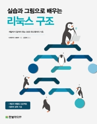

# [ 전문서적 핵심정리 ] "실습과 그림으로 배우는 리눅스 구조" 책 - by 한빛미디어

- 이 책은 추천을 받아서 학습한 책이며
- 이후 공유하고자 핵심 내용들을 정리해보았습니다.
- 아래 내용들을 "이미" 알고 계시는 분들은 이번 내용으로 복습한다 생각하시고 훑고나서 다른 책을 읽는 것을 추천드립니다.

-------------

-------------

# 목차 Table of Contents

- CHAPTER 1 컴퓨터 시스템의 개요
- CHAPTER 2 사용자 모드로 구현되는 기능
- CHAPTER 3 프로세스 관리
- CHAPTER 4 프로세스 스케줄러
- CHAPTER 5 메모리 관리
- CHAPTER 6 메모리 계층
- CHAPTER 7 파일시스템
- CHAPTER 8 저장 장치
- 마치며

-------------

 

-------------

@@include[content.md](content.md)

-------------

 

-------------

## 마치며...

저는 김주혁이라고 합니다.
** URL을 클릭해서 이동하세요 **

- 🌱 Blog (Medium) : [https://medium.com/@beanskobe](https://medium.com/@beanskobe)
- 🌱 Blog (티스토리) : [https://vince-kim.tistory.com/](https://vince-kim.tistory.com/)
- 📫 Portfolio (포트폴리오) : [https://romantic-golick-a520aa.netlify.app](https://romantic-golick-a520aa.netlify.app)
- 📫 Website (웹사이트) : [https://romantic-golick-a520aa.netlify.app](https://romantic-golick-a520aa.netlify.app)
- ✏️ LinkedIn (링크드인) : [https://www.linkedin.com/in/joo-hyuk-kim/](https://www.linkedin.com/in/joo-hyuk-kim/)
- 🌎 Contact me : [beanskobe@gmail.com](mailto:beanskobe@gmail.com)

읽어주셔서 감사합니다!
